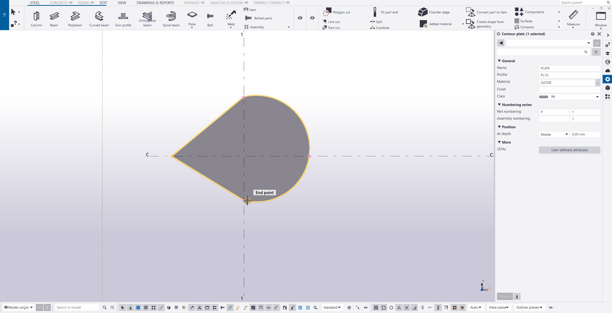

# Muggle Tekla-Plugins

用于 Tekla Structures 的工具和插件。请遵守[开源协议](LICENSE)使用。

基于 2021 版本的 Tekla Open API 开发，其他版本未经测试。

---

## 目录

>开发工具类库

- [Common](#common)

>建模辅助工具

- [ShowModelObjectCoordinateSystem (显示模型零件坐标系)](#showmodelobjectcoordinatesystem-显示模型零件坐标系)
- [SelectBooleans (选择布尔操作对象)](#selectbooleans-选择布尔操作对象)
- [SelectWeldedModelObjects (选择焊缝的焊接对象)](#selectweldedmodelobjects-选择焊缝的焊接对象)
- [ReorderContourPoints (重排多边形板轮廓点顺序)](#reordercontourpoints-重排多边形板轮廓点顺序)
- [ShowContourOrder (显示轮廓点顺序)](#showcontourorder-显示轮廓点顺序)
- [CopyWithDirection (带基点和方向复制)](#copywithdirection-带基点和方向复制)

>组件

- [MG1001 (门刚系列节点 - 门刚边柱与梁竖向连接)](#mg1001-门刚系列节点---门刚边柱与梁竖向连接)
- [MG1002 (门刚系列节点 - 门刚中柱与梁横向连接)](#mg1002-门刚系列节点---门刚中柱与梁横向连接)
- [HJ1001 (桁架系列节点 - 圆管对接)](#hj1001-桁架系列节点---圆管对接)
- [WK1001 (网壳系列节点 - 方管杆件连接)](#wk1001-网壳系列节点---方管杆件连接)
- [MJ5001 (埋件 - H型梁端头埋件)](#mj5001-埋件---h型梁端头埋件)
- [KJ1001 (框架系列节点 - 箱型柱与H型梁连接)](#kj1001-框架系列节点---箱型柱与h型钢连接)
- [KJ1002 (框架系列节点 - 钢梁翼缘侧向约束)](#kj1002-框架系列节点---钢梁翼缘侧向约束)
- [KJ2001 (框架系列细部 - 箱型柱外包柱脚)](#kj2001-框架系列细部---箱型柱外包柱脚)

---

## Common

定义了一些实用的类型、方法，以及对一些官方实现的方法进行了重写，例如：

- Geometry3dOperation.PositionOfTriangleOnLines 方法，实现求二维平面中三角形三个顶点分别落在三条直线上时的位置。

- IntersectionExtension.LineToLine 方法，是对官方实现 Intersection.LineToLine 的重写，解决在两直线相交的情况下，官方实现求得的线段长度不等于 0.0（虽然官方文档说是等于 0.0，但实际是一个很小的值）的问题。

- IntersectionExtension.ArcToLine 方法，实现求三维空间中圆弧与直线间最短线段，并引申出 IntersectionExtension.CircleToLine 方法，实现求三维空间中圆与直线间最短线段。

- PointsInterval 类，提供了一种求解点区间相关问题的解决方案。

- VectorExtension.GetAngleBetween_Precisely 方法，是对官方实现 Vector.GetAngleBetween 的重写。官方实现对于一些比较小的角度，会按 0.0 返回，本方法可以返回更精确一些的角度。

- PointExtension 和 VectorExtension 的 Transform 系列方法，可以更便捷地在各种变换平面或坐标系中进行转换。

- ...

更多内容参见 [API Reference of Common.chm](Documents/API%20Reference%20of%20Common.chm)。

## ShowModelObjectCoordinateSystem (显示模型零件坐标系)

软件自带的宏每次均需双击启动，且只能运行一次。本工具可以一次启动，多次点选并显示零件的坐标系。调试时很有用。

## SelectBooleans (选择布尔操作对象)

在管桁架建模时很有用，当有很多布尔操作对象重叠在一起时，要选中某一个零件的布尔操作对象很困难，此工具可派上用场，即使视图中关闭了“切割”或“末端对齐”显示也依然能够选中。

## SelectWeldedModelObjects (选择焊缝的焊接对象)

有时创建了大量的焊缝后，个别焊缝看起来很奇怪，又很难确定是哪两个零件之间的焊缝，使用此工具可解决此问题。

## ReorderContourPoints (重排多边形板轮廓点顺序)

不清楚是不是 BUG，有时候绘制多边形板时，实际生成的轮廓点顺序，总是与绘制顺序错一位。

某些情况下顺序很重要时，则可以使用此工具指定顺序。

## ShowContourOrder (显示轮廓点顺序)

显示轮廓点顺序。

## CopyWithDirection (带基点和方向复制)

适用于需要批量复制且带有旋转的情形，避免先复制再一个个旋转角度的繁琐操作。

## MG1001 (门刚系列节点 - 门刚边柱与梁竖向连接)

特点是可以根据端板尺寸自动调整柱高度。参数化组件做不到这一点，需要手动调整柱高。

## MG1002 (门刚系列节点 - 门刚中柱与梁横向连接)

适用于门刚结构等截面或对称变截面中柱，与等截面或楔形梁横向连接。

## HJ1001 (桁架系列节点 - 圆管对接)

特点是对曲线梁，即用 CurvedBeam (曲梁)或 PolyBeam (多边形梁)绘制的梁也适用。参数化组件只能用于直线梁对接，对于曲线梁无法胜任。

缺点是用在多边形梁上时，节点符号的位置会有错位，这是API自身的问题，无法解决。不过不影响使用，无伤大雅。

## WK1001 (网壳系列节点 - 方管杆件连接)

特点是可以自动调整杆件的法向。（目前只能从主界面启动实现此功能，从组件目录启动不会调整法向）

也可以根据指定的最小净间距自动确定连接筒的直径。

## MJ5001 (埋件 - H型梁端头埋件)

适用于H型钢梁端头与混凝土连接。

## KJ1001 (框架系列节点 - 箱型柱与H型钢连接)

包含三种连接形式：1. 翼缘焊接，腹板栓接; 2. 焊短梁，全栓接; 3. 焊短梁，翼缘焊接，腹板栓接。
**已知问题：焊接准备不能作用于非正交梁(指左右歪斜，上下倾斜不影响)，否则会造成模型消失**

## KJ1002 (框架系列节点 - 钢梁翼缘侧向约束)

适用于H型钢梁侧向约束。

## KJ2001 (框架系列细部 - 箱型柱外包柱脚)

柱脚锚栓，外侧栓钉，内部隔板。

