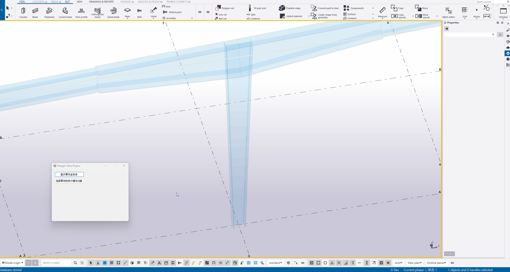

# Muggle Tekla-Plugins
用于Tekla Structures的工具和插件。请遵守[开源协议](LICENSE)使用。

基于2021版本的Tekla Open API开发，其他版本未经测试。

## Common
定义了一些实用的类型、方法，以及对一些官方实现的方法进行了重写，例如：

- Geometry3dOperation.PositionOfTriangleOnLines 方法，实现求二维平面中三角形三个顶点分别落在三条直线上时的位置。

- IntersectionExtension.LineToLine 方法，是对官方实现 Intersection.LineToLine 的重写，解决在两直线相交的情况下，官方实现求得的线段长度不等于0.0（虽然官方文档说是等于0.0，但实际是一个很小的值）的问题。

- IntersectionExtension.ArcToLine 方法，实现求三维空间中圆弧与直线间最短线段，并引申出 IntersectionExtension.CircleToLine 方法，实现求三维空间中圆与直线间最短线段。

- PointsInterval 类，提供了一种求解点区间相关问题的解决方案。

- VectorExtension.GetAngleBetween_Precisely 方法，是对官方实现 Vector.GetAngleBetween 的重写。官方实现对于一些比较小的角度，会按 0.0 返回，本方法可以返回更精确一些的角度。

- PointExtension 和 VectorExtension 的 Transform 系列方法，可以更便捷的在各种变换平面或坐标系中进行转换。

- ...

更多内容参见[API Reference of Common](Documents/API%20Reference%20of%20Common.chm)

## ShowModelObjectCoordinateSystem(显示模型零件坐标系)
软件自带的宏每次均需双击启动，且只能运行一次。本工具可以一次启动，点选并显示多个零件的坐标系。调试时很有用。

## SelectBooleans(选择布尔操作对象)
在管桁架建模时很有用，当有很多布尔操作对象重叠在一起时，要选中某一个零件的布尔操作对象很困难，此工具可派上用场，即使视图中关闭了切割或对齐显示也依然能够选中。

## SelectWeldedModelObjects(选择焊缝的焊接对象)
有时创建了大量的焊缝后，个别焊缝看起来很奇怪，又很难确定是哪两个零件之间的焊缝，使用此工具可解决此问题。

## MG1001(门刚系列节点 - 门刚边柱与梁竖向连接)
特点是可以根据端板高度自动适配调整柱高度。参数化组件做不到这点，打完节点后还要手动调整柱高。

## MG1002(门刚系列节点 - 门刚中柱与梁横向连接)
没什么特点，不过在编写过程中对端板定位的问题费了点脑筋。

## HJ1001(桁架系列节点 - 圆管对接)
特点是对曲线梁(用CurvedBeam(曲梁)或PolyBeam(多边形梁)绘制)也适用。参数化组件只能用于直线梁对接，对于曲线梁无法胜任。

缺点是用在多边形梁上时，节点符号的位置会有错位，这是API自身的问题，无法解决。不过不影响使用，无伤大雅。

## WK1001(网壳系列节点 - 方管杆件连接)
特点是可以自动调整杆件的法向。（目前只能从主界面启动实现此功能，从组件目录启动不会调整法向）

也可以根据指定的最小净间距自动确定连接筒的直径。

**已知问题：盖板与连接筒之间的焊缝，调整不出想要的效果，待解决。**

